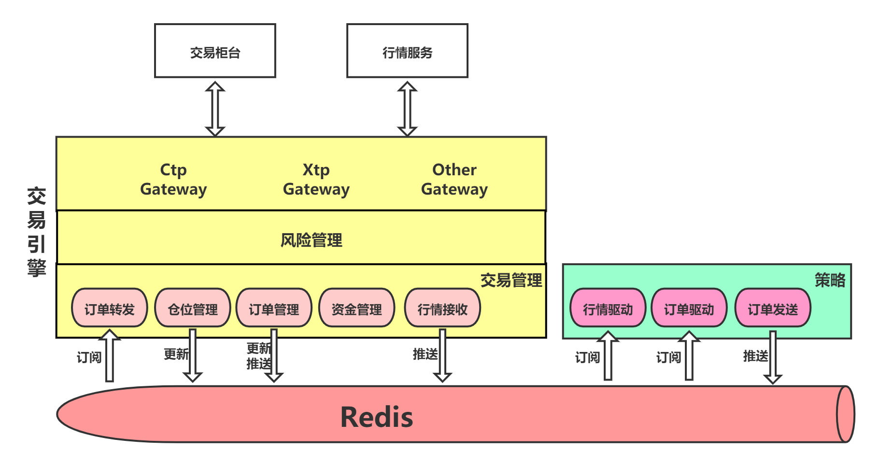

# Flare Trader 算法交易系统
| Platform | Build                                                                                                               |
| -------- | ------------------------------------------------------------------------------------------------------------------- |
| Linux    | [](https://travis-ci.com/DuckDuckDuck0/ft) |

Flare Trader是一套量化交易解决方案，旨在追求以下目标：
* 极低的交易时延，框架耗时控制在2us以内 (进行中)
* 提供从策略开发到部署落地的整个完整的解决方案
* 友好的策略开发接口及框架
* 模块化的设计，可以对各个组件进行定制化开发

目前Flare Trader离上面所列举的目标还差很远，但会持续地更新，大家有想法或是发现了bug，可以在issue上面自由讨论，也欢迎大家参与到ft的开发讨论中。

详细使用及开发文档请移步wiki页面
https://github.com/DuckDuckDuck0/ft/wiki

其他说明 
* 本平台只支持linux，以后也不会支持Windows，需要在Windows上运行的用户自行移植
* 本平台不提供界面，只提供相应的数据获取方式，需要的自行实现监控界面

QQ交流群：341031341

Table of Contents
=================


   * [Flare Trader 算法交易系统](#flare-trader-算法交易系统)
   * [目录](#目录)
      * [Backgroud](#backgroud)
      * [Install](#install)
      * [Usage](#usage)
      * [Maintainers](#maintainers)

## Backgroud
为了解决当前众多Python量化交易框架性能低的问题

先上张图快速了解下ft的架构


## Install
使用cmake(>=3.13)及g++(>=9)进行编译
```bash
$ git clone https://github.com/DuckDuckDuck0/ft.git
$ cd ft
$ mkdir build && cd build
$ cmake ..
$ make -j
```

## Usage
以进行ctp交易为例，假设你现在处于build目录中

先进行ctp登录信息的配置
```bash
$ vim ../config/ctp_config.yml
```
下面是一份simnow的配置文件
```yaml
# backtest api只需要且必须要填api以及contracts_file配置项
# 以下模板为模拟盘或实盘的模板，以ctp为例
gateway: 
  api:  ctp                                               # 必填。现支持ctp/xtp/backtest
  trade_server_address: tcp://123.123.123.123:8888        # 必填。交易柜台地址
  quote_server_address: tcp://180.168.146.187:10131       # 必填。行情服务器地址
  broker_id: 9999                                         # 选填。broker id，根据API选填
  investor_id: 123456                                     # 必填。账户
  password: 1234567                                       # 必填。密码
  auth_code: 0000000000000000                             # 选填。认证码，CTP和XTP都需要
  app_id: simnow_client_test                              # 选填。CTP交易需要

  # 是否在启动时撤销所有未完成订单，默认为true
  cancel_outstanding_orders_on_startup: true

  # 以下是backtest gateway的相关配置
  # extended_args:
  #   match_engine: ft.match_engine.simple
  #   data_feed: ft.data_feed.csv
  #   data_file: xxx/xxx.csv

# 选填。指定用于交易的contracts文件，如果不填写该项，或
# 是路径填写有误，程序会在启动时调用查询接口从服务器查询
# 合约，如果查询成功则使用查询结果，并把查询结果保存至
# ./contracts.csv，如果查询失败或是该Gateway不支持合约查
# 询接口，则程序会退出
global:
  contract_file: ../config/contracts.csv
  trader_db_address: 127.0.0.1:6379


rms:
  - name: ft.risk.fund
  - name: ft.risk.position
  - name: ft.risk.self_trade
  - name: ft.risk.throttle_rate
    order_limit: 10
    period_ms: 10000 


strategy_list: [
  {name: ctp_strategy0, trade_mq: ctp_strategy0_trade_mq, rsp_mq: ctp_strategy0_rsp_mq, md_mq: ctp_strategy0_md_mq, subscription_list: [IF2106]},
]
```
配置完成后，准备启动ft_trader交易通道

如果当前合约文件过于老旧，则在启动ft_trader前，使用contract_collect进行更新
```bash
$ ./contract_collector --config=../config/ctp_config.yml --output=../config/contracts.csv
```

在启动ft_trader前，先启动redis-server服务。如未安装，在ubuntu系统上可通过apt进行安装
```bash
$ sudo apt install -y redis-server
```
安装完毕后启动redis-server
```bash
$ redis-server
```

然后使用该配置文件启动ft_trader交易通道
```bash
$ ./ft_trader --config=../config/ctp_config.yml
```

最后启动demo策略
```bash
$ ./strategy_engine --config=../config/ctp_config.yml --strategy=libspread_arb.so --name=ctp_strategy0
```

## Maintainers
@DuckDuckDuck0
