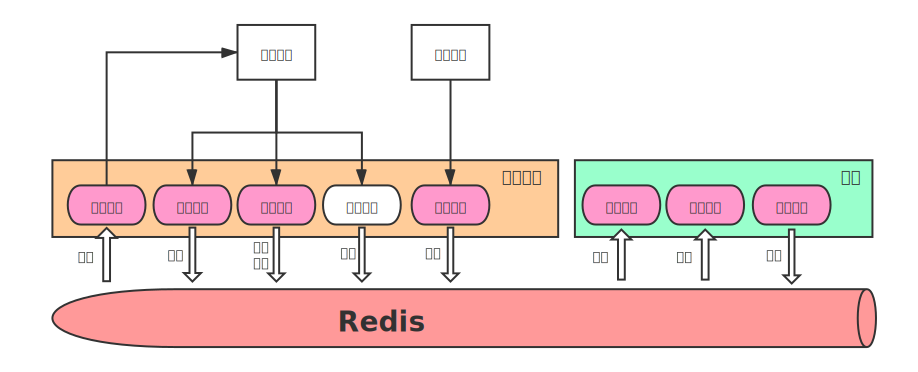

# ft 交易引擎
[toc]

## 1. 简介
### 1.1. ft是什么
ft是一个基于C++的低延迟交易引擎，为策略提供简便的开发、回测环境。实盘目前只支持CTP，后续将根据需求加入其他的接口。回测系统暂时也未提供，但其会尽快提上日程。

### 1.2. 基本架构
ft采用策略引擎与策略分离的体系，即策略引擎与策略引擎是不同的进程，策略引擎为策略提供仓位、订单等操作支持，一个引擎可以对接多个策略，每个策略都分别跑在一个进程上。



## 2. 使用方式
### 2.1. 编译策略引擎及加载器
策略引擎的源码文件为MSE.cpp，策略加载器的源码为StrategyLoader.cpp，使用cmake进行编译
```bash
mkdir build && cd build
cmake .. && make -j4
```

### 2.2. 配置登录信息
```yml
# 可以参考config/login.yml
api: ctp  # api name.
front_addr: tcp://180.168.146.187:10130
md_server_addr: tcp://180.168.146.187:10131
broker_id: 9999
investor_id: 123456
passwd: 12345678
auth_code: 0000000000000000
app_id: simnow_client_test
ticker: rb2009.SHFE,rb2005.SHFE  # subscribed list (for market data).
```

### 2.3. 让示例跑起来
这里提供了一个网格策略的demo
```bash
# 在terminal 0 启动策略引擎
redis-server  # 启动redis，必须在启动策略引擎前启动redis
./MSE --loglevel=debug
```
```bash
# 在terminal 1 启动策略
./strategy_loader -l libgrid_strategy.so -loglevel=debug
```

## 3. 开发你的第一个策略
```c++
// MyStrategy.cpp

#include <AlgoTrade/Strategy.h>

class MyStrategy : public ft::Strategy {
 public:
  bool on_init(AlgoTradingContext* ctx) override {
     // 策略加载完后回调

     // 订阅感兴趣的数据
     // 订阅之后才会在有新的行情数据后收到对应的on_tick回调
     subscribe({"rb2009.SHFE", "rb2005.SHFE"});
  }

  void on_tick(AlgoTradingContext* ctx, const TickData* tick) override {
    // tick数据到来时回调
  }

  void on_exit(AlgoTradingContext* ctx) override {
    // 暂时还没用到
  }
};

EXPORT_STRATEGY(MyStrategy);  // 导出你的策略
```
把上面的代码像网格策略demo一样编译即可通过strategy_loader进行加载了


---
# A Fast Trading System
[toc]
## 1. Introduction
### 1.1 What is ft?
ft is a fast trading system for algo trading based on C++, which focuses on building efficient strategy conveniently.

### 1.2 How to use?
```c++
// MyStrategy.cpp

#include <AlgoTrade/Strategy.h>

class MyStrategy : public ft::Strategy {
 public:
  bool on_init(AlgoTradingContext* ctx) override {
     // called when strategy mounted
     // return true if done
     // return false if you want to init your strategy later for some resources not loaded yet
  }

  void on_tick(AlgoTradingContext* ctx) override {
    // called when tick data arrives
  }

  void on_exit(AlgoTradingContext* ctx) override {
    // called when strategy unmounted
  }
};
EXPORT_STRATEGY(MyStrategy)
```

### 1.3 How to build?
Use cmake to compile your strategy to dynamic library.
```cmake
add_library(MyStrategy SHARED MyStrategy.cpp)
target_link_libraries(MyStrategy ft)
```

### 1.4 Go for it
```
./strategy_loader -l libMyStrategy.so
```

### 1.5 Use it in other ways
Create a StrategyEngine and called StrategyEngine::mount to mount your strategy. It's suggest to compile your strategies to dynamic libraries, and implement a framework using StrategyEngine, then load them dynamicly. If so, you can focus on making your strategies.

### 1.6 Configurations
```yml
api: ctp  # api name.
front_addr: tcp://180.168.146.187:10130
md_server_addr: tcp://180.168.146.187:10131
broker_id: 9999
investor_id: 123456
passwd: 12345678
auth_code: 0000000000000000
app_id: simnow_client_test
ticker: rb2009.SHFE,rb2005.SHFE  # subscribed list (for market data).
```

### 1.7 How to build and run examples
```bash
### build
cd ft  # enter root directory of the project ft
mkdir build && cd build
cmake .. && make

### run
./contract_collector  # build contract table first. Must! After that, you can see contracts.csv in ../config/
vim ../config/login.yml  # config your broker id, investor id and password
./strategy_loader -l libgrid_strategy.so  # run demo of grid strategy
```

## 2. ...
