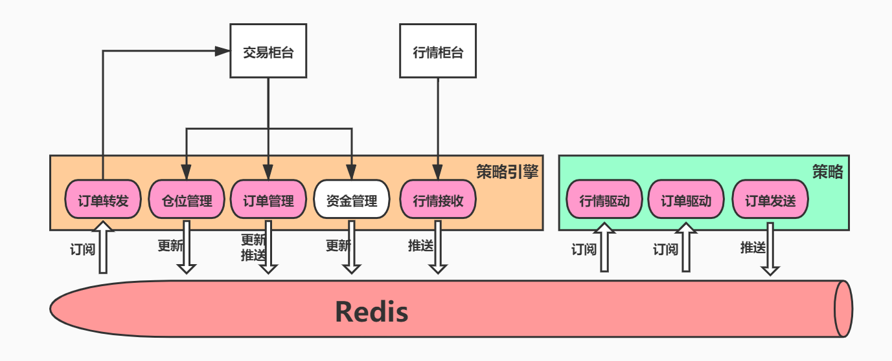
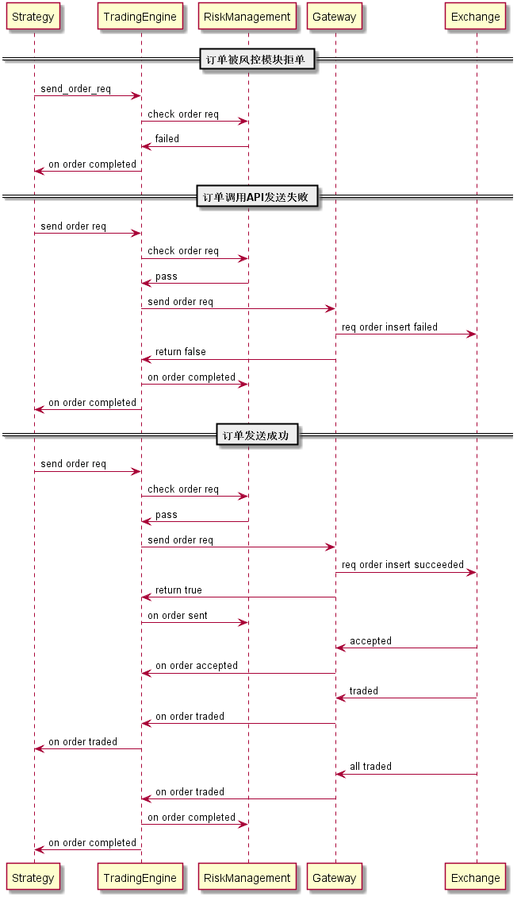
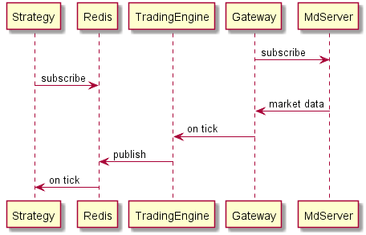
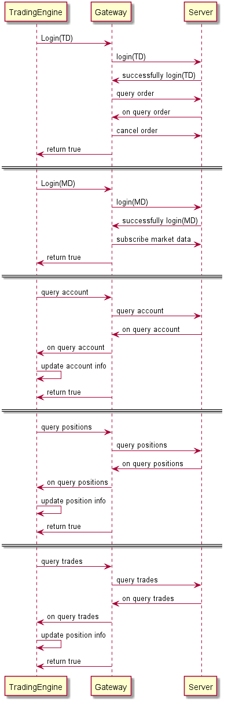

# ft 交易引擎
[toc]

不断更新中，大家有什么想法或是发现了bug，可以一起在issue上面自由讨论，也欢迎大家加入到开发中。如有问题我将全力提供支持。

## 1. 简介
### 1.1. ft是什么
ft是一个基于C++的低延迟交易引擎，为策略提供简便的开发、回测环境。实盘目前只支持CTP，后续将根据需求加入其他的接口。回测系统暂时也未提供，但其会尽快提上日程。ft引擎与策略分离，引擎采用c++编写，高效低时延，而策略通过redis与引擎进行交互，可使用python编写，简洁易部署。

### 1.2. 基本架构
ft采用策略引擎与策略分离的体系，即策略引擎与策略引擎是不同的进程，策略引擎为策略提供仓位、订单等操作支持，一个引擎可以对接多个策略，每个策略都分别跑在一个进程上。


订单发送



数据驱动



策略引擎登录及初始化流程


### 1.3. 目录结构
#### 1.3.1. include
include里面存放的是公共头文件，用户如果想自己为某个服务商的行情、交易接口写Gateway，或是自己写一个交易引擎，就需要用到Core里面的内容。
* 如果需要自定义Gateway，至少需要用到两个头文件：Core/Gateway.h 以及 Core/TradingEngineInterface.h。Gateway.h里面是Gateway的基类，用户需要继承该基类并实现一些交易接口（如下单、撤单等）。同时，Gateway也要在按照约定去回调TradingEngineInterface中的函数（如收到回执时），TradingEngineInterface的子类就是交易引擎，用于仓位管理、订单管理等，通过回调告知交易状态或是查询信息。详情参考这两个头文件里的注释，以及CtpGateway的实现
* 如果需要自定义交易引擎，也至少需要：Core/Gateway.h 和 Core/TradingEngineInterface.h。交易引擎通过继承TradingEngineInterface获知账户的各种交易信息并管理之，而通过调用gateway的交易接口或是查询接口去主动发出交易请求或是查询请求。可参考TradingSystem目录中的实现
* Core里其他的文件定义的都是一些基本的交易相关数据结构
#### 1.3.2. Gateway
Gateway里是各个经纪商的交易网关的具体实现，可参考Ctp的实现来实现自己需要的网关
#### 1.3.3. TradingSystem
TradingSystem是本人实现的一个交易引擎，向上通过redis和策略进行交互，向下通过Gateway和交易所进行交互
#### 1.3.4. Tools
一些小工具，但是很必要。主要是ContractCollector，用于查询所有的合约信息并保存到本地，供其他组件使用
#### 1.3.5. RiskManagement
风险管理。考虑是否要合并到其他目录

## 2. 使用方式
### 2.1. 编译策略引擎及加载器
策略引擎的源码文件为MSE.cpp，策略加载器的源码为StrategyLoader.cpp，使用cmake进行编译
```bash
mkdir build && cd build
cmake .. && make -j4
```

### 2.2. 配置登录信息
```yml
# 可以参考config/login.yml
api: ctp  # api name.
front_addr: tcp://180.168.146.187:10130
md_server_addr: tcp://180.168.146.187:10131
broker_id: 9999
investor_id: 123456
passwd: 12345678
auth_code: 0000000000000000
app_id: simnow_client_test
ticker: rb2009.SHFE,rb2005.SHFE  # subscribed list (for market data).
```

### 2.3. 让示例跑起来
这里提供了一个网格策略的demo
```bash
# 在terminal 0 启动策略引擎
redis-server  # 启动redis，必须在启动策略引擎前启动redis
./MTE --loglevel=debug --login-config=../config/login.yml --contracts-file=../config/contracts.csv
```
```bash
# 在terminal 1 启动策略
./strategy_loader -l libgrid_strategy.so -loglevel=debug --contracts-file=../config/contracts.csv
```

## 3. 开发你的第一个策略
```c++
// MyStrategy.cpp

#include <Strategy/Strategy.h>

class MyStrategy : public ft::Strategy {
 public:
  bool on_init(AlgoTradingContext* ctx) override {
     // 策略加载完后回调

     // 订阅感兴趣的数据
     // 订阅之后才会在有新的行情数据后收到对应的on_tick回调
     subscribe({"rb2009.SHFE", "rb2005.SHFE"});
  }

  void on_tick(AlgoTradingContext* ctx, const TickData* tick) override {
    // tick数据到来时回调
  }

  void on_exit(AlgoTradingContext* ctx) override {
    // 暂时还没用到
  }
};

EXPORT_STRATEGY(MyStrategy);  // 导出你的策略
```
把上面的代码像网格策略demo一样编译即可通过strategy_loader进行加载了
